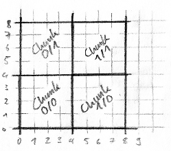

Static World
============

Abstract
--------

The static world consists of a possibly infinitly large [voxel map](https://en.wikipedia.org/wiki/Voxel).

The map is divided into a grid of 3D chunks of equal size.
Each loaded chunk stores the visual and physical representation of the voxels it contains.

As static game objects are often larger than a single voxel, it would become
tedious and error prone working with larger ones.

For this reason an abstraction layer was created:

Structures define logical voxel groups like doors or machines, which span
multiple voxels or just things like stone blocks, which take only a single
voxel.

Voxels
------

Chunks
------

Structures
----------

<!--Structures are data-access-objects that ease voxel access.-->
